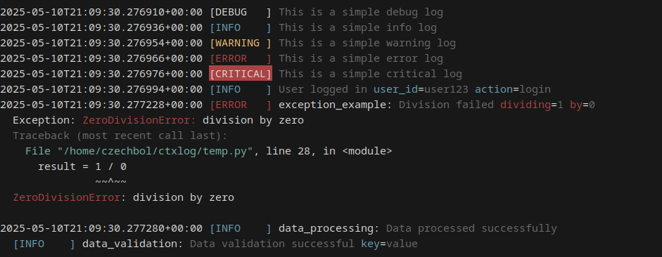

.. ctxlog documentation master file

ctxlog
======

.. image:: https://img.shields.io/pypi/v/ctxlog.svg
   :target: https://pypi.org/project/ctxlog/
   :alt: PyPI version

.. image:: https://img.shields.io/pypi/pyversions/ctxlog.svg
   :target: https://pypi.org/project/ctxlog/
   :alt: Python versions

.. image:: https://img.shields.io/pypi/l/ctxlog.svg
   :target: https://github.com/czechbol/ctxlog/blob/main/LICENSE
   :alt: License

A structured logging library for Python that allows for context-rich, nested logs.

This library was inspired by the `Canonical Log Lines <https://brandur.org/canonical-log-lines>`_, which emphasizes the importance of reducing the amount of noise in logs for better observability and debugging. With the addition of log chaining, `ctxlog` allows to create log trees that can be used to track complex operations and their context, similar to tracing mechanisms.

Features
--------

- **Structured Logging**: Structured logs with context fields with optional JSON serialization
- **Context-Rich**: Extend the logs with additional context information over the course of an action
- **Log Chaining**: Create nested log contexts for tracking complex operations

Contents
--------

.. toctree::
   :maxdepth: 2

   installation
   quickstart
   configuration
   advanced
   api/index
   changelog
   license
